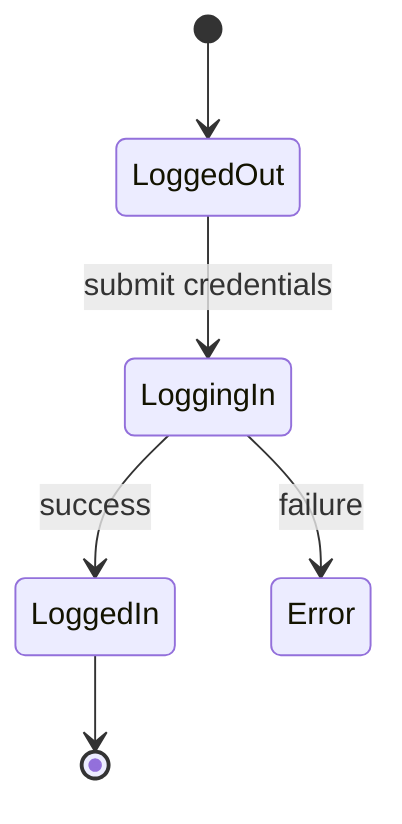
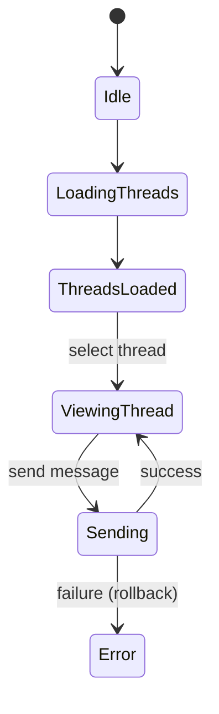

# FIGMA_MAP — sedā.fm Prototype ↔ Implementation

**Prototype:** https://www.figma.com/make/YyM14YgNr0dsbrIdpBi2yN/Sed%C4%81.fm---prototype-1?node-id=0-1&t=sA1e20cPivoBzHQB-1  
**Source of truth:** PRD embedded in Claude prompt  
**Scope:** Phase 1 (wire existing APIs), Phase 2 (Wave A/B scaffolding), Phase 3 (plan-only)

---

## Conventions

- **Frame IDs** follow `Section / ScreenName` (adjust to your actual Figma frame names).  
- **Routes** assume Next.js-style paths.  
- **APIs** assume Express/tRPC parity; paths shown as REST for clarity.  
- Use `#COMPLETION_DRIVE` comments if you make assumptions while implementing.

---

## Phase 1 — Screens using existing APIs (connect now)

| Figma Frame | Purpose | Route (web) | Component(s) | API(s) / Events |
|---|---|---|---|---|
| Auth / Login | Email/SSO login | `/login` | `AuthLoginPage`, `useAuth()` | Supabase Auth or `/auth/*` (existing) |
| Auth / Signup | Account creation | `/signup` | `AuthSignupPage` | Supabase Auth or `/auth/*` (existing) |
| Auth / Session Restore | Auto-restore session | N/A (middleware) | `withAuth`, `authMiddleware` | Supabase session API |
| Verification / Claim Code | Artist verification via code | `/verify/artist` | `VerifyArtistPage` | `POST /verification/claim-code` (existing) |
| Chat / List | Conversations list | `/chat` | `ChatList`, `ChatLayout` | `/chat/list` (existing) + sockets or polling |
| Chat / Thread | Conversation thread | `/chat/[threadId]` | `ChatThread`, `MessageComposer` | `/chat/threads/:id` (existing) + send message |
| Admin / Moderation | Flag review, actions | `/admin/mod` | `AdminModerationPanel` | `/admin/*` moderation endpoints (existing) |

**State Diagram — Auth (Mermaid)**

**State Diagram — Chat (Mermaid)**

---

## Phase 2 — Wave A (Profiles & Playlists)

| Figma Frame | Purpose | Route (web) | Component(s) | API(s) / DB |
|---|---|---|---|---|
| Profiles / View (Fan) | Public fan profile | `/u/[username]` | `ProfilePage` | `GET /profiles/:username` |
| Profiles / Edit | Edit own profile | `/settings/profile` | `ProfileEditForm` | `PATCH /profiles/:username` (self) |
| Profiles / View (Artist) | Public artist profile | `/a/[username]` | `ArtistProfilePage` | `GET /profiles/:username` + artist extras |
| Playlists / View | View playlist | `/pl/[playlistId]` | `PlaylistPage` | `GET /playlists/:id` |
| Playlists / Create | Create playlist | `/playlists/new` | `PlaylistCreateForm` | `POST /playlists` |
| Playlists / Add Item | Add track to playlist | Inline modal | `AddTrackModal` | `POST /playlists/:id/items` |

**Suggested Data** (see migration in Wave A package):
- `profiles(id, user_id, username, display_name, bio, avatar_url, created_at, updated_at)`
- `playlists(id, owner_user_id, title, description, is_public, is_collaborative, created_at, updated_at)`
- `playlist_items(id, playlist_id, position, provider, provider_track_id, title, artist, artwork_url, added_by_user_id, added_at)`
- `playlist_collaborators(playlist_id, user_id, role, added_at)`

**Flags (default OFF):** `FEATURE_PROFILES`, `FEATURE_PLAYLISTS`

---

## Phase 2 — Wave B (Social, Leaderboards, Trophy Case)

| Figma Frame | Purpose | Route (web) | Component(s) | API(s) / DB |
|---|---|---|---|---|
| Social / Follow Button | Follow user/artist | Inline (profile) | `FollowButton` | `POST /social/follow`, `DELETE /social/follow` |
| Social / Likes | Like track/post | Inline (cards) | `LikeButton` | `POST /social/like`, `DELETE /social/like` |
| Leaderboards / Global | Global ranks | `/leaderboards/global` | `LeaderboardList` | `GET /leaderboards?scope=global` |
| Leaderboards / Genre | Genre ranks | `/leaderboards/genre/[genre]` | `LeaderboardList` | `GET /leaderboards?scope=genre&genre=...` |
| Leaderboards / Channel | Channel ranks | `/leaderboards/channel/[id]` | `LeaderboardList` | `GET /leaderboards?scope=channel&id=...` |
| Leaderboards / Artist | Artist hub ranks | `/leaderboards/artist/[username]` | `LeaderboardList` | `GET /leaderboards?scope=artist&username=...` |
| Trophy Case | Earned badges | `/u/[username]/trophies` | `TrophyGrid` | `GET /trophies/:username` |

**Notes**
- DJ Points power **badges, leaderboards, trophy case**. The specific point events are **deferred (not MVP)**.
- Store minimal events now (likes, follows, session hosts) to enable future scoring.

**Flags:** `FEATURE_SOCIAL`, `FEATURE_LEADERBOARDS`, `FEATURE_TROPHY_CASE`

---

## Phase 3 — Plan Only

| Figma Frame | Purpose | Route (web) | Component(s) | API(s) / Notes |
|---|---|---|---|---|
| Player / Mini-bar | Persistent player | Global shell | `PlayerBar`, `usePlayer` | `PlayerService` interface; adapters for Spotify/Apple/Beatport |
| DJ Mode / Queue | Turn-based queue | `/dj/[channelId]` | `NowPlaying`, `QueueList`, `VoteBar` | Queue mgmt, 50% auto-skip; plan-only |
| Discovery / Search | Search people/tracks | `/search` | `SearchBox`, `ResultsList` | Postgres FTS (MVP), Typesense/Meili later |

---

## API Crosswalk (at-a-glance)

- **Profiles** → `GET /profiles/:username`, `POST /profiles`, `PATCH /profiles/:username`
- **Playlists** → `GET /playlists/:id`, `POST /playlists`, `PATCH /playlists/:id`, `POST /playlists/:id/items`
- **Social** → `POST/DELETE /social/follow`, `POST/DELETE /social/like` (Wave B)
- **Leaderboards** → `GET /leaderboards?scope=...` (Wave B)
- **Trophies** → `GET /trophies/:username` (Wave B)
- **Chat** → existing `/chat/*` + sockets (Phase 1)
- **Verification** → existing `/verification/*` (Phase 1)
- **Admin** → existing `/admin/*` (Phase 1)

---

## Open Questions (`#COMPLETION_DRIVE`)

1. **Artist profile extras:** source of discography (provider APIs) and display fields.  
2. **Playlist item dedupe:** allow duplicates? per-user or global?  
3. **Username canonicalization:** case-insensitive routing and uniqueness policy.  
4. **Leaderboard cadence:** real-time counters vs. scheduled recompute window.  
5. **Trophies data model:** single table vs. materialized view per profile.  
6. **Auth scopes for provider adapters:** when we implement Player/Discovery.  
7. **RLS policies:** exact rules by role; cross-table collaborator access.  
8. **Pagination defaults:** e.g., playlist items page size and cursor strategy.
